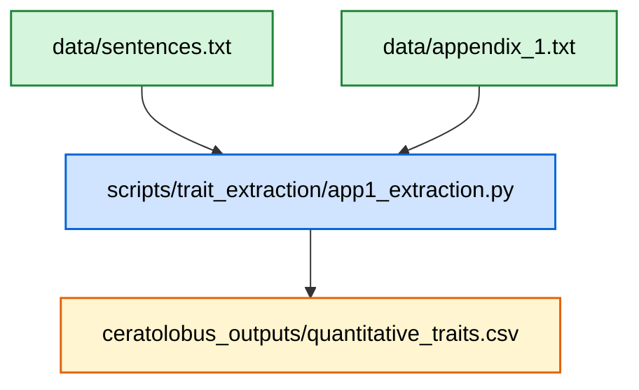
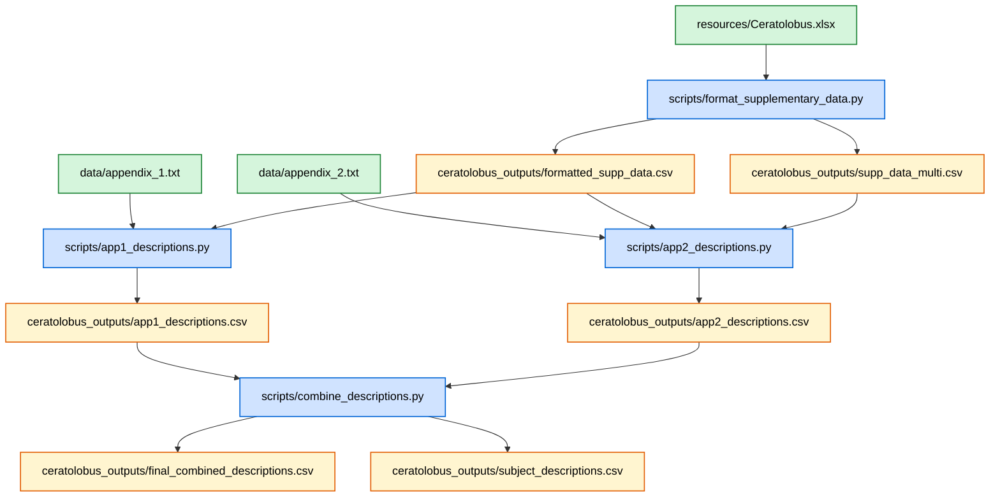

# Summary of the Content in this Repo

## What Does Each Script do?

### Cleaning Input Data etc  

| File Name | Description |
| --------- | ----------- |
| [clean_appendix.py](https://github.com/KewBridge/CalamusTraits/blob/main/scripts/monograph_text_extraction/clean_appendix.py) | Processes the appendices, combines them with the subject metadata, and converts them to csv files.   |
| [extract_treatments.py](https://github.com/KewBridge/CalamusTraits/blob/main/scripts/monograph_text_extraction/extract_treatments.py) | Identifies relevant sections of the monograph, extracts them, and outputs a csv of the taxonomic treatments. |
| [term_mapper_extract.py](https://github.com/KewBridge/CalamusTraits/blob/main/scripts/monograph_text_extraction/term_mapper_extract.py) | Used in [extract_treatments.py](https://github.com/KewBridge/CalamusTraits/blob/main/scripts/monograph_text_extraction/extract_treatments.py) and [clean_appendix.py](https://github.com/KewBridge/CalamusTraits/blob/main/scripts/monograph_text_extraction/clean_appendix.py). Standardises the subject names used for extracting traits. |
| [term_mapper_gen.py](https://github.com/KewBridge/CalamusTraits/blob/main/scripts/monograph_text_extraction/term_mapper_gen.py) | Used in [extract_treatments.py](https://github.com/KewBridge/CalamusTraits/blob/main/scripts/monograph_text_extraction/extract_treatments.py) and [clean_appendix.py](https://github.com/KewBridge/CalamusTraits/blob/main/scripts/monograph_text_extraction/clean_appendix.py). Standardises the subject names used for generating descriptions. |

```mermaid
graph TD
    %% Nodes
    clean_appendix[scripts/clean_appendix.py]
    extract_treatments[scripts/extract_treatments.py]
    appendix_1[resources/appendix_1.txt]
    appendix_2[resources/appendix_2.txt]
    monograph_pdf[resources/calamus_monograph.pdf]
    target_species[resources/ceratolobus_target_species.txt]

    data_appendix_1[data/appendix_1.txt]
    data_appendix_2[data/appendix_2.txt]
    data_treatments[data/treatments.txt]
    data_sentences[data/sentences.txt]

    %% Edges
    clean_appendix --> data_appendix_1
    clean_appendix --> data_appendix_2
    appendix_1 --> data_appendix_1
    appendix_2 --> data_appendix_2

    extract_treatments --> data_treatments
    extract_treatments --> data_sentences
    monograph_pdf --> data_treatments
    monograph_pdf --> data_sentences
    target_species --> data_treatments
    target_species --> data_sentences

    %% Styles
    style clean_appendix fill:#d0e3ff,stroke:#0366d6,stroke-width:1.5px
    style extract_treatments fill:#d0e3ff,stroke:#0366d6,stroke-width:1.5px

    style appendix_1 fill:#d5f5dc,stroke:#22863a,stroke-width:1.5px
    style appendix_2 fill:#d5f5dc,stroke:#22863a,stroke-width:1.5px
    style monograph_pdf fill:#d5f5dc,stroke:#22863a,stroke-width:1.5px
    style target_species fill:#d5f5dc,stroke:#22863a,stroke-width:1.5px

    style data_appendix_1 fill:#fff5d0,stroke:#e36209,stroke-width:1.5px
    style data_appendix_2 fill:#fff5d0,stroke:#e36209,stroke-width:1.5px
    style data_treatments fill:#fff5d0,stroke:#e36209,stroke-width:1.5px
    style data_sentences fill:#fff5d0,stroke:#e36209,stroke-width:1.5px
```

### Extracting Traits

| File Name | Description |
| --------- | ----------- |
| [app1_extraction.py](https://github.com/KewBridge/CalamusTraits/blob/main/scripts/trait_extraction/app1_extraction.py) | Extracts quantitative traits, as defined in appendix 1, from species descriptions in the monograph. |
| [app2_extraction.py](https://github.com/KewBridge/CalamusTraits/blob/main/scripts/trait_extraction/app2_extraction.py) | Extracts qualitative traits, as defined in appendix 2, from species descriptions in the monograph. Prompt style can be chosen (located in [prompt.py](https://github.com/KewBridge/CalamusTraits/blob/main/scripts/trait_extraction/prompts.py)): Chain-of-thought prompting, breaking down the task into logical steps; fewshot provides a few examples to guide the model's response; cot-fewshot combines chain-of-thought reasoning with a few examples; zeroshot provides no examples or intermediate reasoning, just directly generates the output. (not included in makefile) |

### Generating Descriptions

| File Name | Description |
| --------- | ----------- |
| [format_supplementary_data.py](https://github.com/KewBridge/CalamusTraits/blob/main/scripts/description_generation/format_supplementary_data.py) | Reformats the supplementary data ready to be used by an LLM to generate species descriptions. Outputs 2 files: one with all traits, one with traits that vary among the specimens examined. |
| [app1_descriptions.py](https://github.com/KewBridge/CalamusTraits/blob/main/scripts/description_generation/app1_descriptions.py) | Descriptions of quantitative traits are generated by an LLM using the formatted supplementary data and appendix 1. |
| [app2_descriptions.py](https://github.com/KewBridge/CalamusTraits/blob/main/scripts/description_generation/app2_descriptions.py) | Uses an LLM to match rules in appendix 2 to the values in the formatted supplementary data - combines relevant traits into output sentences. |
| [combine_descriptions.py](https://github.com/KewBridge/CalamusTraits/blob/main/scripts/description_generation/combine_descriptions.py) | For each subject (leaf, stem etc.) sentences/clauses  generated from [app1_descriptions.py](https://github.com/KewBridge/CalamusTraits/blob/main/scripts/description_generation/app1_descriptions.py) and [app2_descriptions.py](https://github.com/KewBridge/CalamusTraits/blob/main/scripts/description_generation/app2_descriptions.py) are combined into concise sentences using an LLM. The output is a paragraph description of each species in a .csv file. The `--subject_sentence` option can be used from the command line to keep sentences separate by subject (good for comparison of LLm-written vs. human-written descriptions). |

## Files Used and Created

### resource/... Files

| File Name | Description |
| --------- | ----------- |
| [resources/appendix_1.txt](https://github.com/KewBridge/CalamusTraits/blob/main/resources/appendix_1.txt) | Text file containing the quantitative trait appendix. |
| [resources/appendix_2.txt](https://github.com/KewBridge/CalamusTraits/blob/main/resources/appendix_2.txt) | Text file containing the qualitative trait appendix. Qualitative traits are assigned numerical values based on a set of rules. The more complicated the rules, the harder it is for the LLM to assign correctly. |
| target_species files | Contains the 6 species formerly in the genus *Ceratolobus* (the subset of *Calamus* that this project focuses on). There are two more target species file - these are for the 12 other species used in the project, however the repo focuses on *Ceratolobus*|
| [resources/Ceratolobus.xlsx](https://github.com/KewBridge/CalamusTraits/blob/main/resources/Ceratolobus.xlsx) | The monograph's supplementary data, subset to contain only *Ceratolobus* species (*C. concolor group*). |

### data/... Files

| File Name | Description |
| --------- | ----------- |
| data/appendix_1.txt | csv of appendix 1. Separates the description, abbreviation, unit, source, and subject. |
| data/appendix_2.txt | csv of appendix 2. Separates the rules, codes, subjects, and any extra information that might be present in the appendix. |
| data/treatments.txt | The extracted treatments for each of the target species |
| data/sentences.txt | The treatments are split up into sentences / phrases and categorised. |

### ceratolobus_outputs/... Files

| File Name | Description |
| --------- | ----------- |
| formatted_supp_data.csv | Formatted supplementary data matrix to be used by an LLM to generated species descriptions. |
| supp_data_multi.csv | Due to variation among specimens of the same species, some traits are scored with multiple different values. This .csv file stores these traits and their associated data to be processed by an LLM separately. |
| app1_descriptions.csv | Descriptions of the quantitative traits, categorised by subject. |
| app2_descriptions.csv | Descriptions of the qualitative traits, categorised by subject. |
| final_combined_descriptions.csv | A paragraph description of each species. Combing app1_descriptions.csv and app2_descriptions.csv. |
| subject_descriptions.csv | Descriptions are combined but separated by subject. Useful for comparison to human-written descriptions (not included in `make all`) |
| quantitative_traits.csv | This file stores the output of the qualitative trait extraction. |
