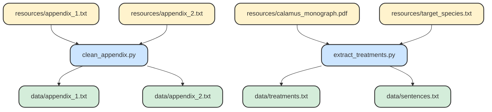

# Summary of the Content in this Repo

## Workflow

**Mermaid diagram made using the [Makefile](https://github.com/KewBridge/CalamusTraits/blob/main/Makefile). Shows dependencies and outputs for each file / script.**

## What Does Each Script do?

| File Name | Description |
| --------- | ----------- |
| [clean_appendix.py](https://github.com/KewBridge/CalamusTraits/blob/main/clean_appendix.py) | Processes the appendices, combines them with the subject metadata, and converts them to csv files.   |
| [extract_treatments.py](https://github.com/KewBridge/CalamusTraits/blob/main/extract_treatments.py) | Identifies relevant sections of the monograph, extracts them, and outputs a csv of the taxonomic treatments. |
| [app1_extraction.py](https://github.com/KewBridge/CalamusTraits/blob/main/app1_extraction.py) | Extracts quantitative traits, as defined in appendix 1, from species descriptions in the monograph. |
| [trait_extraction_app2.py](https://github.com/KewBridge/CalamusTraits/blob/main/trait_extraction_app2.py) | Extracts qualitative traits, as defined in appendix 2, from species descriptions in the monograph. |
| [term_mapper.py](https://github.com/KewBridge/CalamusTraits/blob/main/term_mapper.py) | Used in [extract_treatments.py](https://github.com/KewBridge/CalamusTraits/blob/main/extract_treatments.py) and [clean_appendix.py](https://github.com/KewBridge/CalamusTraits/blob/main/clean_appendix.py). Standardises the subject names. |
| [format_supplementary_data.py](https://github.com/KewBridge/CalamusTraits/blob/main/format_supplementary_data.py) | Reformats the supplementary data ready to be used by an LLM to generate species descriptions. |

## resource/... Files

| File Name | Description |
| --------- | ----------- |
| [resources/appendix_1.txt](https://github.com/KewBridge/CalamusTraits/blob/main/resources/appendix_1.txt) | Text file containing the quantitative trait appendix. |
| [resources/appendix_2.txt](https://github.com/KewBridge/CalamusTraits/blob/main/resources/appendix_2.txt) | Text file containing the qualitative trait appendix. Qualitative traits are assigned numerical values based on a set of rules. The more complicated the rules, the harder it is for the LLM to assign correctly. |
| [resources/target_species.txt](https://github.com/KewBridge/CalamusTraits/blob/main/resources/target_species.txt) | Contains the 6 species in *Ceratolobus* (the subset of *Calamus* that this project focuses on). |
| [resources/Ceratolobus.xlsx](https://github.com/KewBridge/CalamusTraits/blob/main/resources/Ceratolobus.xlxs) | The monograph's supplementary data, subset to contain only *Ceratolobus* species. |

## data/... Files

| File Name | Description |
| --------- | ----------- |
| data/appendix_1.txt | csv of appendix 1. Separates the description, abbreviation, unit, source, and subject. |
| data/appendix_2.txt | csv of appendix 2. Separated the rules, codes, subjects, and any extra information that might be present in the appendix. |
| data/treatments.txt | The extracted treatments for each of the target species. |
| data/sentences.txt | The treatments are split up into sentences / phrases and categorised. |
| data/formatted_supp_data.csv | Formats the supplementary data to be used by an LLM to generated species descriptions. |
