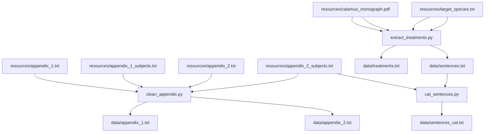

# Summary of the Content in this Repo

## Workflow

**Mermaid diagram made using the [Makefile](https://github.com/KewBridge/CalamusTraits/blob/main/Makefile). Shows dependencies for each file / script.**

## What Does Each Script do?

| File Name | Description |
| --------- | ----------- |
| [clean_appendix.py](https://github.com/KewBridge/CalamusTraits/blob/main/clean_appendix.py) | Processes the appendices, combines them with the subject metadata, and converts them to csv files.   |
| [extract_treatments.py](https://github.com/KewBridge/CalamusTraits/blob/main/extract_treatments.py) | Identifies relevant sections of the monograph, extracts them, and outputs a csv of the taxonomic treatments. |
| [sentences_cat.py](https://github.com/KewBridge/CalamusTraits/blob/main/sentences_cat.py) | Uses an LLM to categorise each sentences in the species descriptions, and outputs a csv of sentences followed by their category. |
| [trait_extraction_app1.py](https://github.com/KewBridge/CalamusTraits/blob/main/trait_extraction_app1.py) |  |
| [trait_extraction_app2.py](https://github.com/KewBridge/CalamusTraits/blob/main/trait_extraction_app2.py) | |
