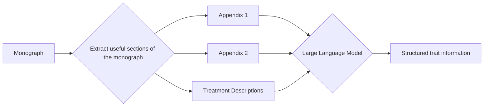

# CalamusTraits

This project explores transitioning between trait matrices and textual descriptions of species, using a subset of the palm genus *Calamus*.

Calamus was recently monographed in Henderson, A., 2020. A revision of Calamus (Arecaceae, Calamoideae, Calameae, Calaminae). Phytotaxa 445, 1–656. [doi: 10.11646/phytotaxa.445.1.1](https://doi.org/10.11646/phytotaxa.445.1.1)

## Timeline

- 2024-09-19 [NN](https://github.com/nickynicolson) presented "New tools for taxonomy" to the Integrated Monography group at Kew, demonstrating [echinopscis](https://echinopscis.github.io/) and large language models, including associated projects run by [Eren Karabey](https://github.com/erenkarabey) ([KewBridge/specimens2illustrations](https://github.com/KewBridge/specimens2illustrations)) and [Young Jun Lee](https://github.com/yjkiwilee). Follow-up discussion focussed on how we could use these tools / techniques in the re-curation of *Calamus*.
- 2024-09-19 Ben Kuhnhaeuser shared data on *Ceratolobus*, a distinct clade with *Calamus*:
> I’m sending through a few resources on Ceratolobus, a morphologically and phylogenetically well-defined clade and former genus that is now subsumed in Calamus. It contains six species, C. concolor, C. disjunctus, C. glaucescens, C. hallierianus, C. pseudoconcolor,  and C. subangulatus. All species are described in Henderson 2020, which is accompanied by a supplementary data matrix: https://phytotaxa.mapress.com/pt/article/view/phytotaxa.445.1.1. Bill tells me that the supplementary is also available on Zenodo (although I didn’t manage to track it down there) and as such in the public domain. I’m attaching here only the Ceratolobus rows of the spreadsheet, which is only a tiny fraction of the entire dataset. The column abbreviations are explained in the main manuscript in appendices I (p. 478) and II (pp. 479-486). I think it makes most sense for you to mine the treatment of each species directly from the pdf by search for the species names, instead of me sending you screenshots, but I’m just attaching an example treatment for one at the bottom of the email so that you can get an idea what the treatments look like.
> We currently have a phylogeny including four of these species, which the samples being linkable to herbarium specimens if that is of interest.
> 
> 
> Does that suffice for a start? Further down the line, we can also approach sourcing images (in situ photographs and technical drawings) and digging out previous taxonomic treatments of these species, e.g. in field guides.

## Sample treatment

> **132. _Calamus hallierianus_ (Beccari ex Heyne) Baker (2015b: 235)**. _Ceratolobus hallierianus_ Beccari ex Heyne
(1913: 93). Lectotype (designated here):—INDONESIA. Borneo, Soengei Kenepai, 1893–1894, _H. Hallier 2088_
(lectotype L!, isolectotype BO!).
> 
> _Ceratolobus discolor_ Beccari (1886: 63) _nom. illeg., non Calamus discolor_ Martius (1838: 212). _Calamus ceratolobus_ Baker (2015a:
150). Type:—MALAYSIA. Sarawak, no date, _O. Beccari 1915_ (holotype FI!).
_Calamus georgei_ Baker (2015a: 150). _Ceratolobus kingianus_ Beccari & Hooker in Hooker (1893: 477), _non Calamus kingianus_ Beccari
(1908a: 197). Lectotype (designated by Dransfield 1979b):—MALAYSIA. Perak, Larut, March 1882, _Dr. King’s collector 2856_
(lectotype FI!, isolectotype K!, LE _n.v._, LE image!).
> 
> **Stems** clustered, rarely solitary, climbing, 11.8(3.0–20.0) m long, 1.9(0.7–3.2) cm diameter. **Leaf sheaths** tubular,
closed opposite the petiole, with a knee below the petiole; leaf sheaths with numerous spicules borne on short, low,
horizontal ridges, easily detached and leaving the sheaths with ridges only, sometimes with larger spines present;
ocreas short, membranous, not spiny, with external and internal abscission zone, splitting and falling early; flagella
absent; petioles 22.7(1.0–86.0) cm long; rachises 67.8(47.0–141.0) cm long, the apices extended into an elongate
cirrus, without reduced or vestigial pinnae, adaxially flat, abaxially with more or less regularly arranged (at least
proximally), distantly spaced clusters of dark–tipped, recurved spines, terminating in a stub, without a shallow groove
adaxially; **pinnae** 7(4–10) per side of rachis, regularly arranged, rhombic, the lateral veins diverging, the two distal
margins praemorse, without spinules on veins, grayish-white indumentose abaxially; middle pinnae 25.5(13.0–45.0)
cm long, 9.1(3.0–17.5) cm wide; proximalmost pinnae sometimes much reduced and swept back across the sheath.
**Inflorescences** diverging from sheath well below sheath apex, with two vertical ridges distal to point of divergence,
erect to arching, short, without any recurved spines, terminating in a short, obscure stub; peduncles very short, not
spiny, without a prophyll scar at the apex; prophylls flattened, persistent, usually non–spiny, splitting only at the
apex by two short, lateral splits; partial inflorescences stalked; rachis bracts much reduced, papery, with one side
of the oblique apex extended into a longer limb; rachillae sessile; staminate inflorescences branching not recorded,
30.8(27.0–34.5) cm long; staminate rachillae and flowers not recorded; pistillate inflorescences branched to 2 orders,
51.3(25.0–81.0) cm long; pistillate rachillae 3.3(1.8–4.5) cm long, with alternately and distichously arranged dyads
of 1 pistillate and 1 neuter flower borne on short, stout pedicels; pistillate calyces cupular, shallowly 3-lobed; fruits
globose, 15.1(11.3–19.6) cm long, 13.0(9.2–16.5) mm diameter, color not recorded; fruiting perianths explanate; fruit
scales deeply channeled longitudinally; seeds 1 per fruit, basally attached, small, ellipsoid, with a ventral depression,
reniform in longitudinal section, the dorsal surfaces pitted, covered with a tanniniferous, non-fibrous sarcotesta; raphe
branches obscure; endosperm with deep, pit-like ruminations; embryos at or near base of seed.
> 
> **Distribution and habitat**:—Peninsular Malaysia, Sumatra, and Borneo (Brunei, West, Central, and South
Kalimantan, Sarawak) (Fig. 60) in lowland rainforest at 157(10–500) m elevation.
> 
> **Taxonomic notes**:—_Calamus hallierianus_ was previously included in _Ceratolobus_ and is a member of the _C.
concolor_ group (see notes under that species). It is similar to _C. glaucescens_ in its pinnae that are indumentose abaxially
but differs from that species by its leaf sheaths with numerous spicules.
_Ceratolobus kingianus_ is included here; it shares all qualitative variable states with _C. hallierianus_ (see also
Dransfield 1979b).
> 
> **Subspecific variation**:—_Calamus hallierianus_ has a similar distribution to that of _C. subangulatus_, and within
each of the three areas where it occurs (Peninsular Malaysia, Sumatra, and Borneo) it shows considerable variation.
In Peninsular Malaysia, plants occur in three separate populations. Specimens from the west side (Perak) have thicker
stems and larger pinnae; those from the northeast (Terengganu) have longer petioles, longer rachises and more pinnae
per side of the rachis; and specimens from the southeast (Pahang, Johore) have narrower stems, shorter petioles, and
fewer, smaller pinnae.
> 
> Specimens from Sumatra are relatively uniform but occur only in a small area. _Calamus hallierianus_ is widespread
in Borneo but mostly in the central part of the island. Several specimens are problematic. One specimen (_Ramos 1490_)
is said on the label to come from Sandakan in Sabah, far outside the range of other specimens. A sterile specimen
(_Mogea 7398_), from far outside the range of other specimens in South Kalimantan, has an unusual, spiny sheath. A
specimen (_Peters s.n._) is also unusual in its spiny leaf sheaths, small fruits, and habitat. The label records the habitat as
“seasonally inundated forest … flooded 4 to 6 months a year”.

## Process

## How to run the scripts

This assumes that you have cloned the repository to a machine where you have: (a) a local installation of Python, (b) the build tool `make` and (c) a command line terminal program to run the following commands:

1. Set up a virtual environment: `python -m venv env` and activate it: `source env/Scripts/activate`
2. Install the libraries: `pip install -r requirements.txt`
3. Copy the source PDF to the `resources`1 directory, name it `calamus_monograph.pdf`
4. Run the script to extract trait defintions and species descriptions: `make all`
